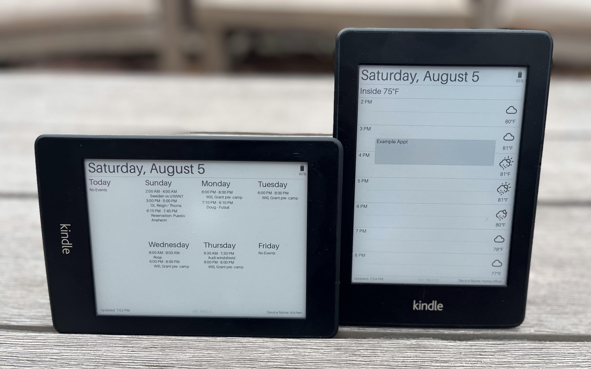
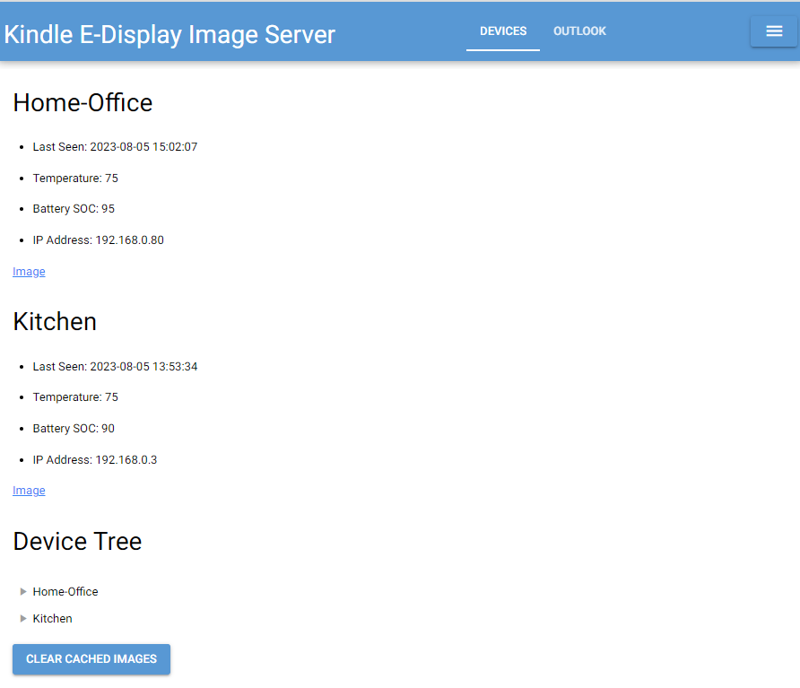
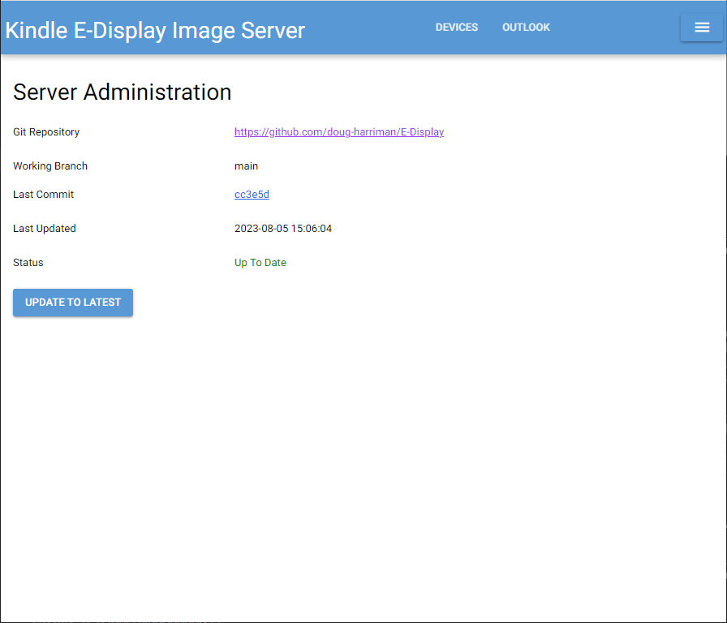
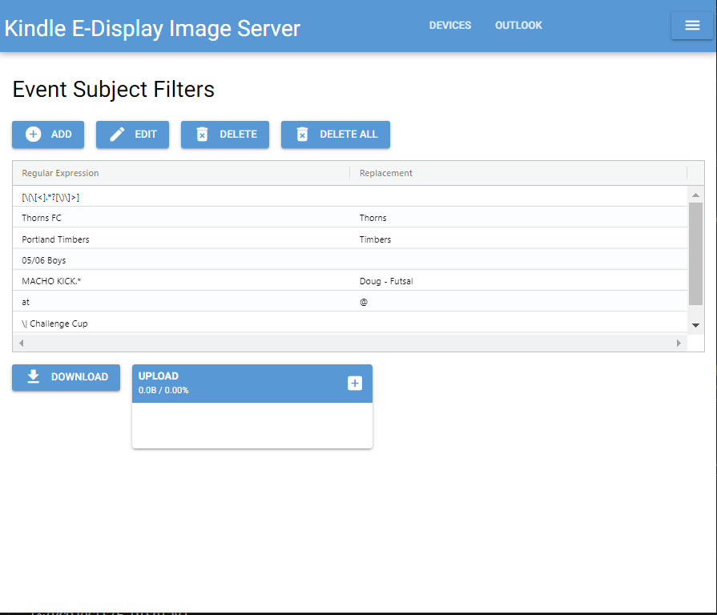
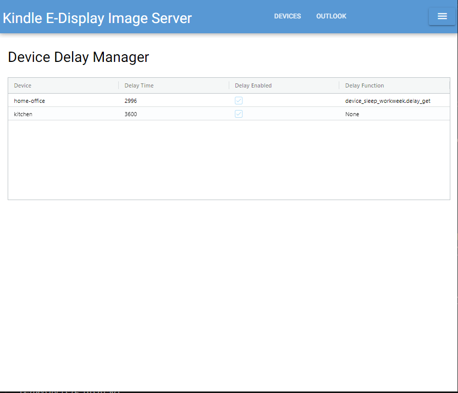
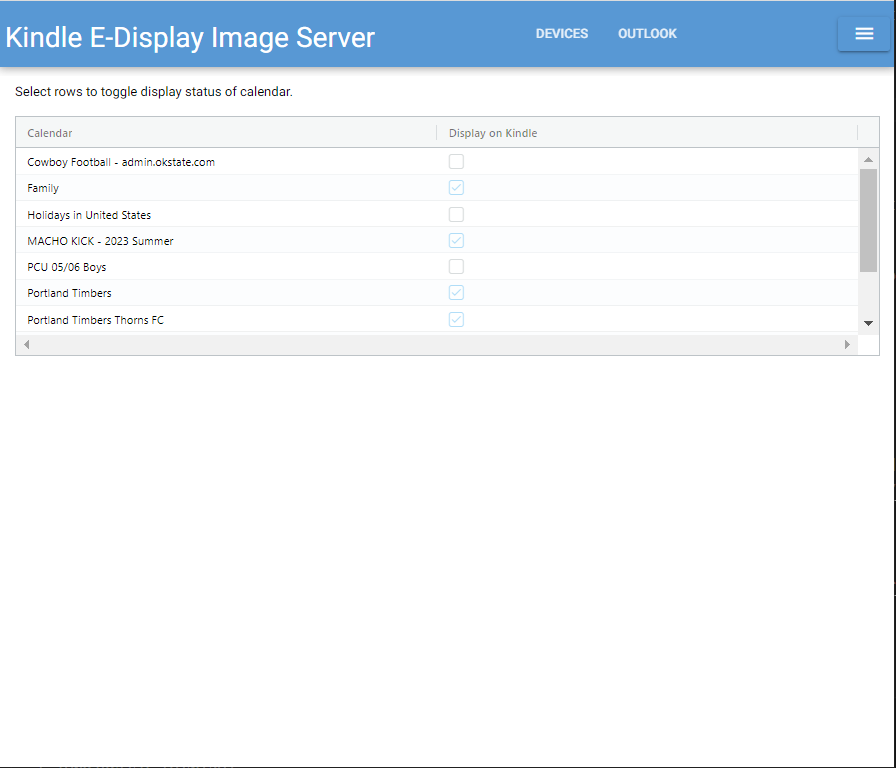
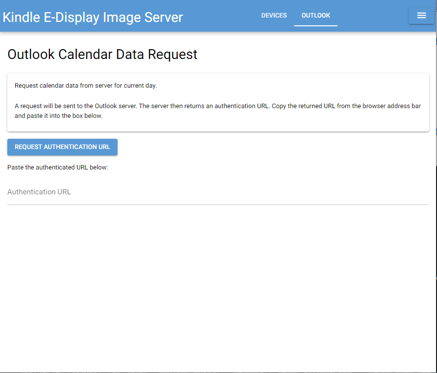

# Electronic Image Display Server

Image server for remote electronic displays such as a Kindle.

The image below shows my two devices, one displaying my work calendar in a portrait orientation, the other displaying the family calendar for the week in landscape.



|Server Pages|||
|-|-|-|
|||
|||

## Motivation

This project was motivated by two desires:
1. To have a nice display of my work calendar on my desk, available at a glance without having to open up Outlook.  
2. To learn about web programming via Python.  

I know there's a lot of stuff here that could be greatly improved.  Please submit pull requests if you'd like to help.

## Project Inspiration & References

There are many impressive projects out there that do similar things.  They've both inspired this project and provided great references for technical implementations.  Some great projects to check out:

* [Matt Healy's](https://matthealy.com/kindle) project was the one that originally inspired me.  
    * I preferred to directly generate images for specific devices rather than generate web pages then convert to images.
    * He provides great instructions for the install process.  Great overview.
    * I'm still working on getting a frame like he has.  
* A cuple of weather display projects that I really liked due to their use of weather icons:
    * [Weather Display](https://mpetroff.net/2012/09/kindle-weather-display/)
    * [Kindle Weather](https://github.com/DDRBoxman/kindle-weather)
        * SVG Files for weather icons, fonts too.
        * [Great example of managing Kindle services](https://github.com/DDRBoxman/kindle-weather/blob/master/kindleweather.sh).
* [A wall paper project](https://github.com/pablojimenezmateo/kindle-wallpaper)
    * Dumps the image file into the screensaver and reboots.
    * Sets a cron job to generate a new screen saver image once per day.
    * SVG files for weather icons.
* Two projects that dive deeper into reducing Kindle power usage:
    * [One with full power saving](https://github-com.translate.goog/nicoh88/kindle-kt3_weatherdisplay_battery-optimized?_x_tr_sl=auto&_x_tr_tl=en&_x_tr_hl=en)
    * [Another with power saving](https://www.martinpham.com/2023/01/07/reviving-unused-kindle-ebooks/)
* [A list of other Kindle projects from Mobileread](https://www.mobileread.com/forums/showthread.php?t=128704&highlight=wake+sleep+command).

## Key System Features

* Image generation performed on server to keep display device code as simple as possible.  This also allows for easy updates to the display without having to update the device.
* Server code constructed to support multiple display devices, so only a single server is needed.
* Display device can request sleep time from server, so that it can go into low power mode.  This allows the server to have complex logic to determine sleep duration based on a variety of factors.  I use it to reduce my work calendar display refresh rate during non-work hours.
    * Images are be pre-generated just ahead of wake time so that they're ready without wait mimimizing device battery usage.
* Display device can send basic state information (battery state of charge and local temperature) to server which is stored in an [SQLite3](https://www.sqlite.org/index.html) database.  State information can then be used for image generation.
* Server code constructed to support plugins, so features can be added easily and auto-discovered.

### Feature Details
* High-res image generation via [Pillow](https://pillow.readthedocs.io/en/stable/).
* Reusable image header and footer.
    * Header
        * Current day of week, month and date.
        * Battery state of charge.
    * Footer
        * Last update time (last time image was generated on server).
        * Device IP address.
        * Device name.
* Weather
    * Query weather forecast from USA National Weather Service.
    * Map weather forecast to icons.
* Google Calendar
    * Query events
    * Generate one week calendar image.
    * Select which of your Google calendars to display.
* Microsoft Outlook 365 Calendar
    * Query events
    * Generate hour by hour event image for the current day.
    * Display hour by hour weather forecast.
    * Request authentication URL from the web page, and apply the URL.  By default, some Outlook setups required admin approval for access longer than 24 hours.  This simplifies daily re-authentication.
* Custom string filters to remove unwanted text from event subjects for cleaner display.
* Display properties for Kindle Paperwhite
    * Screen resolution & size
    * Color maps (grayscale)
    * Fonts
* HTTP Post to MQTT Bridge
    * Post state information to MQTT broker.
    * Keeps device software simple.  MQTT data stream without adding MQTT client to device.
    * Additional small MQTT process to push MQTT data to Influx DB.
* Server software updates via `git pull` from direcltly from web server.

## Installation

* `sudo apt install libvips`
    * [PyVips](https://libvips.github.io/pyvips/index.html) to load and render SVG into Pillow images.
* `pip install -r requirements.txt` (in server directory)

## Configuration

* Copy `google-credentials.json` and `google-token.json` to server.
* Google Calendar
    * When token expires the token file will be deleted if it cannot be refreshed.
    * Manually run the `calendar_google.py` script.
    * Follow the link it provides & confirm access.
    * `google-token.json` will be created.

## Run

```bash
cd server
./serve.sh
```

## Creating a New Device Image

## Creating a New Plugin

## Next Tasks

- [ ] Server: Family calendar image weather added
- [ ] Server: Review TODO's
- [ ] Server: Retrieve google cal events with async to speed up download of multiple calendars.
    - Google cal asyncio: https://pypi.org/project/aiogc/
    - Gathering results: https://superfastpython.com/asyncio-gather/#:~:text=main%20done-,Example%20of%20gather()%20With%20Return%20Values,-We%20may%20execute
- [ ] Server: Log to file. 
- [ ] Server: renderer base should accept a layout parameter (landscape, portrait) and then manage resolution and image rotation internally.
- [ ] Server: Containerize to Docker.  
- [ ] Server: Make MQTT2InfluxDB a daemon and run on container.
- [ ] Server: Icon updates.
    - Would be nice to have a battery outline icon to better match the weather icons.
    - During initial icon search, had trouble finding good SVG sets.  After battery icon was implemented found [Icônes](https://icones.js.org/), which has a lot of really good looking options.  
        - From there, these look like good battery icon options:
            - https://icones.js.org/collection/mingcute?s=battery
            - https://icones.js.org/collection/typcn?s=battery
        - Potential weather changes
            - https://icones.js.org/collection/mdi?s=weather
            - https://icones.js.org/collection/uil?s=cloud


