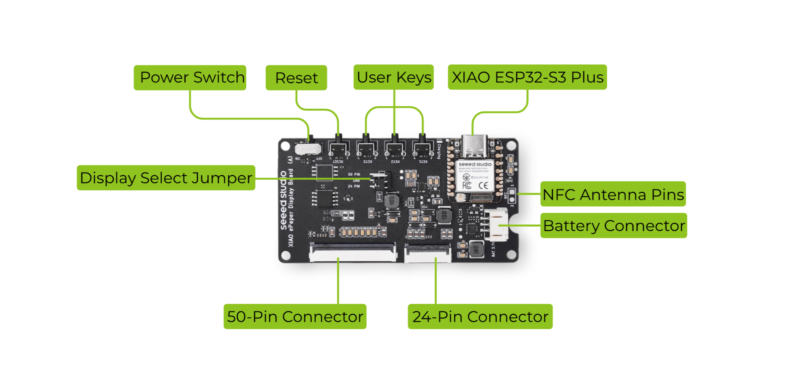

# TRMNL 7.5" DIY Kit

## PCA Connections

## Reseting

To force a reset, hold the microswitch on the ESP daughterboard while pressing the reset button on the main board. There are two microswitches on the daughterboard.  The one for boot is closer to the battery plug.

## Links

* [Firmware GitHub](https://github.com/Seeed-Projects/Seeed_TRMNL_Eink_Project)
* [SEEED Studio Page](https://wiki.seeedstudio.com/trmnl_7inch5_diy_kit_main_page/)
* [SEEED Studio EE04 Display Board Page](https://wiki.seeedstudio.com/epaper_ee04/)
* [Overview Blog](https://www.seeedstudio.com/blog/2025/09/19/build-your-own-custom-e-ink-display-with-the-trmnl-diy-kit/)
* 3D Printed Enclosure Designs
   * [Triangular](https://www.printables.com/model/1354873-triangular-prism-3d-enclosure-for-trmnl-75-og-diy)
   * [L-Shaped](https://www.printables.com/model/1354879-l-shape-3d-enclosure-for-trmnl-75-og-diy-kit)

